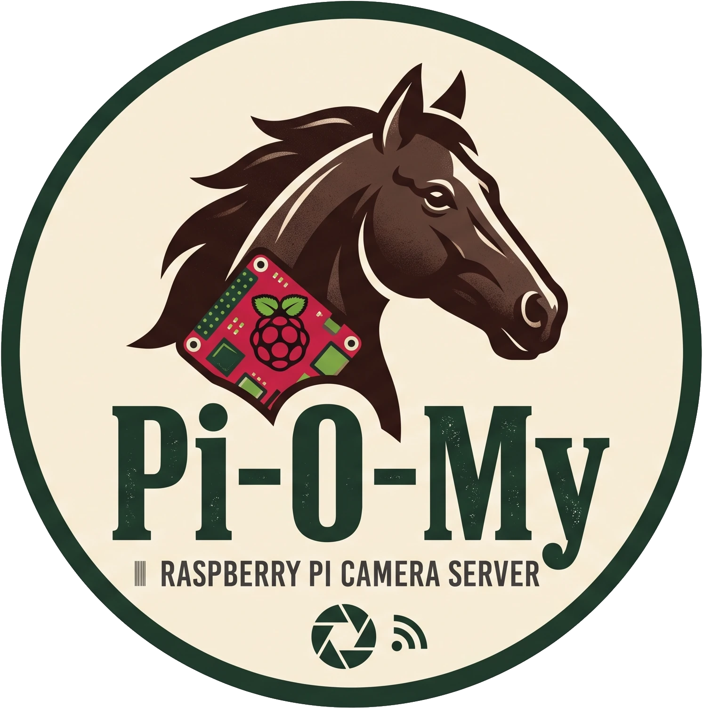

# Pi-O-My

<p align="center">
  
</p>

a security camera application for the Raspberry Pi.

- Saves high-res stills to a **local USB SSD** (configurable path)
- Rotates by **minimum free space**: every 100 captures, deletes the oldest day folder if needed (skips today and a recent-day grace window)
- Live **MJPEG** preview and archive browser (LAN, password auth)
- Optional **Samba sync** via `rclone` (near-recent remote copy, not realtime)

Works on Pi 3 with Camera Module v1.3 / v2 (and similar libcamera modules).

## Hardware notes

- Boot OS from microSD; ideally put the archive on a USB SSD (mount by UUID in `/etc/fstab`). Continuous stills writes wear out microSD cards quickly.
- Use a solid 5V PSU (2.5A-class or better).

**Camera LED (optional):** Behind glass, the board's red LED can reflect into night shots. To disable it, add this to `config.txt` and reboot:

```ini
# /boot/firmware/config.txt  (Bookworm) or /boot/config.txt
disable_camera_led=1
```

Some places require a visible recording indicator and/or camera signage. Disabling the LED may not be allowed where you install it. Check local rules.

## Quick start (development)

Requires [uv](https://github.com/astral-sh/uv).

```bash
uv sync
export PIOMY_CONFIG="$PWD/config.dev.yaml"
export PIOMY_MOCK_CAMERA=1
mkdir -p /tmp/piomy-archive
cp config.example.yaml config.dev.yaml
# set archive_dir and password_hash, or:
uv run python -c "
from pathlib import Path
import yaml
from piomy.auth import hash_password
p = Path('config.dev.yaml')
d = yaml.safe_load(p.read_text())
d['storage']['archive_dir'] = '/tmp/piomy-archive'
d['web']['password_hash'] = hash_password('changeme')
p.write_text(yaml.safe_dump(d, sort_keys=False))
"

# terminal 1
PIOMY_CONFIG=$PWD/config.dev.yaml PIOMY_MOCK_CAMERA=1 uv run piomy-capture

# terminal 2
PIOMY_CONFIG=$PWD/config.dev.yaml uv run piomy-web
```

Open `http://127.0.0.1:8080` (any username, password `changeme`).

## Install on the Pi

```bash
sudo apt update
sudo apt install -y git python3-picamera2 rclone curl
# mount SSD e.g. at /var/lib/piomy/archive  (fstab by UUID)
sudo ./scripts/install.sh
```

Later code updates (skips uv bootstrap / user setup / venv recreate):

```bash
sudo ./scripts/install.sh --update
```

The install venv uses `--system-site-packages` so apt's `picamera2` is importable.

Default UI password after install: `changeme`. Change it under **Settings**.

Units:

- `piomy-capture`: camera, writes stills
- `piomy-web`: UI / MJPEG / archive / settings
- `piomy-sync`: optional Samba push (`rclone`)

```bash
sudo systemctl status piomy-capture piomy-web piomy-sync
curl -u :changeme http://PI_IP:8080/health
```

Config: `/etc/piomy/config.yaml` (or set `PIOMY_CONFIG`).

On a Pi 3 (1 GiB RAM), keep `web.workers: 1` (the default). Extra uvicorn workers often get OOM-killed and respawn in a loop (`Child process ... died`). Use `workers: 2` only if you have spare RAM (e.g. Pi 4/5).

## Samba sync

1. Install `rclone` on the Pi: `sudo apt install -y rclone`
2. Create `/etc/piomy/smb.cred` with the share password only (one line), then make it readable by the `piomy` service user:

```bash
sudo sh -c 'printf "%s\n" "your-share-password" > /etc/piomy/smb.cred'
sudo chown root:piomy /etc/piomy/smb.cred
sudo chmod 640 /etc/piomy/smb.cred
```

3. In Settings: SMB URL (`//host/share/piomy`), username, enable sync, set remote `max_age_days`.
4. Start / enable the sync unit (install already enables it; use this if you set up sync later):

```bash
sudo systemctl enable --now piomy-sync
sudo systemctl status piomy-sync
```

5. Local archive is the source of truth; remote is a near-recent copy.

## Archive browsing

Day -> hour -> 10-minute block -> paged thumbs (60/page).

Open a frame for Older / Newer (crosses days). Arrow keys work; neighbors are prefetched.

**Latest images** jumps to the last page of the newest 10-minute block.

## Layout

```text
{archive_dir}/YYYY/MM/DD/HHMMSS_ffffff.jpg
{archive_dir}/latest.jpg
{archive_dir}/.thumbs/...
{archive_dir}/.piomy_status.json
```

## Tests

```bash
uv sync --group dev
uv run pytest
```

## License

MIT. See [LICENSE](LICENSE).
